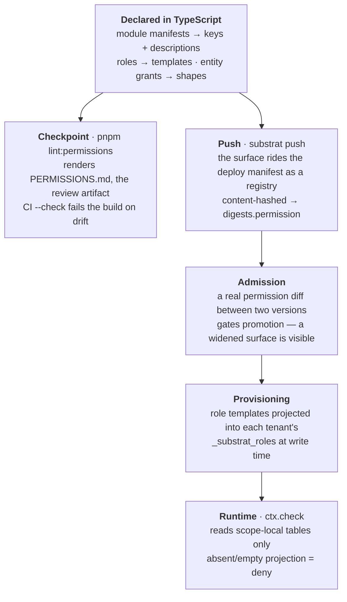

# Permissions

The permission **model** is kernel-owned — it is enforcement input, never delegated to
an auth provider. The **evaluation engine** is an adapter behind one interface, with a
built-in relationship-tuple engine as the default.

## The authored surface

Humans (and agents, under review) write three kinds of things:

### Permission keys

Module-namespaced strings declared in the [manifest](/concepts/modules) with
human-readable descriptions:

```
workorder:create   Create work orders
workorder:report   Start work, report time and material
invoicing:export   Export an invoice basis (makes it immutable)
```

### Roles @ nodes

A role bundles permissions; an assignment binds a principal to a role **at a node of the
tenancy tree** — the tenant root or a specific scope — with inheritance down the tree:

```ts
host.admin.defineRole(tenantId, {
  key: 'technician',
  permissions: ['workorder:read', 'workorder:report'],
  source: 'vertical',
});

host.admin.assignRole({
  principalId: tech,
  roleKey: 'technician',
  node: { tenantId, scopeId: stockholmBranch }, // or scopeId: null = whole tenant
});
```

### Capability grants

Narrow, direct, time-boxable grants — one permission, one node, optionally **narrowed to
one entity** and its declared descendants:

```ts
host.admin.grant({
  principalId: portalCustomer,
  permission: 'workorder:read',
  node: { tenantId, scopeId: branch },
  entity: { entityType: 'facility', entityId: theirBuilding },
  expiresAt: nextMonth,      // optional
  grantedBy: adminPrincipal,
});
```

Entity-narrowed grants are how portal users (a customer, a board member, a
subcontractor) see only *their* facilities and orders inside a shared scope. Grants can
also target an **organization**; members reach them via membership.

A **connection** is a first-class grant subject too — not only principals and orgs. A
connector (an external provider acting through a connection) can hold a capability grant
without pretending to be a person: `host.admin.grantToConnection(...)`, and a check's
subject is polymorphic (`{ kind: 'principal' | 'connection' | 'system', id }`). A
connection is keyed `(tenant, vertical, provider)`, so granting it one permission reaches
only that tenant's scopes running that vertical — the blast radius of a leaked provider
token is one permission on one vertical's data, readable in a diff.

A **module's system principal** is the third such subject — the caller behind
[scheduled work](/concepts/modules#recurring-work-schedules). A schedule runs an operation
on a timer, and it is not a person either; `host.admin.grantToSystem(...)` gives
`{ kind: 'system', id: moduleId }` exactly the permissions the schedule declared, so the
operation's own `ctx.check` resolves the same way it does for anyone — the gate stays the
check, never a bypass — and the emitted events read as `{ system: '@your/module' }`. Like a
connection it holds no memberships; its authority is exactly the grants written against
`system:<moduleId>`, projected at provisioning and revocable per scope.

Organizations are a real directory record, not a string you make up at the call site:

```ts
await host.admin.createOrg(actor, {
  id: orgId,          // branded ULID — slug and name are attributes, not identity
  tenantId,
  slug: 'acme',       // unique within the tenant
  name: 'Acme AB',
});
```

`addMember`, `removeMember`, `listMembers` and `grantToOrg` all **fail closed on an org
that does not exist in that tenant**. That refusal is the point of the record: a grant to
an org nobody registered would otherwise look applied, resolve for nobody, and still show
up in the permission diff as though access had been conferred. Because the id is a ULID
rather than a name, renaming an org cannot orphan the tuples that reference it.

## From declaration to enforcement

The **keys and role templates** are declared in TypeScript — the same objects the host
registers ([module manifests](/concepts/modules) declare the keys, provisioning declares the
roles). That declared surface is not trusted to stay honest by convention; it passes three
successive gates on its way to a running scope:



Three kinds of honesty, at three altitudes:

- **Review-time.** `PERMISSIONS.md` is the human-readable render of the surface — the artifact
  for the [permission checkpoint](/concepts/modules). Because CI regenerates it with `--check`
  and fails on any difference, a role that gains a key cannot merge without showing up in the
  diff a reviewer must approve. The check reads the *same* declared objects the host registers,
  so the artifact cannot drift from what is enforced.
- **Deploy-time.** The surface is carried in the version's deploy manifest and content-hashed
  as `digests.permission`, so **admission** can compute a genuine permission diff between the
  running version and the incoming one. The declared surface is **immutable per version** — it
  is a property of the code, frozen when that version is built.
- **Request-time.** Roles and grants are *projected* into each scope's own tables at write
  time; the checker reads only that local projection (see below), and an absent or empty
  projection is a **deny**. Missing data can only ever remove authority, never confer it.

This is the same layering the rest of the model rests on: the **declared** surface is a
per-version code fact, **operator** state (a tenant's live roles) is a runtime-mutable table,
and **minted** grants are scope-local tuples. None is a copy that can silently diverge from the
others — each is the authority for its own layer.

## Evaluation: relationship tuples with a fixed algebra

Internally, the built-in checker compiles the authored surface into relationship tuples
(`subject → relation → object`) and evaluates checks with a **fixed, four-rule
derivation algebra**:

1. **Role expansion** — principal has role, role carries permission.
2. **Tenancy-tree inheritance** — permission at a node flows down to child scopes.
3. **Entity parent edges** — declared in module manifests (`workorder → facility`) and
   written at runtime via `ctx.link`; entity-narrowed grants flow along these edges,
   depth-capped.
4. **Org/group membership** — grants to an organization reach its members.

No negation, no configurable rewrite rules. Verticals never see or author tuples — roles
and grants remain the only authored surface.

**Where tuples live — a scope reads only its own state.** Scope and entity tuples (rules 2
and 3) live in the scope's own database and are evaluated inside its serialization domain, so
there is no distributed-consistency problem for them. Tenant-level facts — role *definitions*,
role assignments, tenant grants, and org membership (rules 1 and 4) — are tenant-wide, so the
**directory** (the control plane) is their authority. But the checker never reads the directory
on a request: the control plane **projects** those facts into scope-local tables
(`_substrat_roles`, `_substrat_tenant_tuples`) at *write* time, and the checker reads the
projection exactly as it reads scope tuples.

This is the important shift, and it is deliberate: **the control plane is a write-time
authority that projects into scopes; it is never a read-time dependency on the request path.**
Cost moves from the read path (every request) to the write path (rare role/grant changes) —
the correct direction for a read-heavy multi-tenant system, and what makes a scope genuinely
isolated: it can run as its own Cloudflare Worker with *no* control-plane binding at all. (For
the earlier per-request model and why it was replaced — scaling, isolation, and the
untrusted-vertical requirement — see the
[scope-local permissions design note](https://github.com/substrat-run/substrat/blob/main/docs/architecture/scope-local-permissions.md).)

The consistency consequence is small and one-directional. Scope-level grants/roles stay
synchronous and immediately consistent ("no zookies") — the checker runs in the scope's own
serialization domain. Only **tenant-level** changes are now eventually consistent across a
tenant's scopes, bounded by the write-time fan-out and a reconciliation sweep. An **absent or
empty projection is a deny**, byte-for-byte the normal deny path, so missing data can only ever
*remove* authority, never grant it. Revocation still fans out as tombstones (below) — now into
every scope the tuple was projected to.

## Revocation: tuples tombstone, they never disappear

Access is withdrawn by **tombstoning** a tuple — it keeps its row, gains a `revokedAt`,
and the checker's walk skips it. Nothing deletes a tuple.

That is deliberate. A tuple that once granted access is the evidence of *why* an access
was allowed, so deleting it destroys the audit trail exactly where it is most needed: a
deleted row can show neither that access was revoked nor that it was ever granted. Every
revocation path in the kernel works this way — `removeMember` is the first of them — and
`listMembers({ includeRevoked: true })` is the evidence view over the result.

Liveness is therefore one predicate, applied identically everywhere: a tuple grants only
while it is **unexpired and unrevoked**. Expiry (`expiresAt` above) and revocation are
siblings, not separate mechanisms. The checker interface is deliberately swappable (an OpenFGA-backed adapter is
the designated alternative), and any implementation must pass the same contract tests.

## Decisions carry proof

```ts
type Decision =
  | { allowed: true; proof: RelationTuple[] }   // the chain that granted access
  | { allowed: false; checked: PermissionKey; node: Node };
```

An allow **always** carries the tuple chain that produced it — an unexplained allow is
unrepresentable. This powers:

- **explain** — why does this user see this?
- **view-as-user** — render any screen as any principal, with real decisions;
- **the human-readable permission diff** — the review artifact for the permission
  checkpoint: who gains what, where in the tree.

And it carries past the request: when an operation emits, the kernel stamps onto the event
envelope which permission(s) it checked-and-passed and — when the allow came through a
capability grant rather than a role — a ref to the granting tuple (`authorization`, K-34).
The full chain is re-derivable by `explain`; what re-derivation cannot recover once tuples
have since changed is *which* permission and grant were consulted at write time. That pointer
is what the envelope keeps, so a mutation carries its own proof of authority
([Events & audit](/concepts/events)). Decisions carry proof forward, not only at the instant
they are made.

## Denials are recorded

An allow leaves its trace on the event it authorized; a **denial** has no event to ride, so
it is captured on its own. When an enforced check refuses, the kernel writes a row to a
scope-local `_substrat_denials` table (`id`, `actor`, `permission`, `tenant_id`, `scope_id`,
`operation`, `at`, `drained_at`) — the one moment where an actor's intent and the permission
model visibly disagree, and which no other log witnesses (the admin log records changes, the
outbox records *allowed* mutations). Because a denial rolls its operation back, the row is
written **outside** that transaction, at the operation boundary after the rollback, so the
record survives the very failure it describes.

This is **not** the K-24 staff-directory read log (`_substrat_access_log`): that records
control-plane *reads* against the directory; `_substrat_denials` records refused checks inside
a scope. Two different tables for two different facts. Both *drain* rather than expire —
`drained_at` marks a row shipped onward, and only a drained row may be pruned.

## In operations

The standard first line of every operation:

```ts
import { assertAllowed } from '@substrat-run/kernel';

const handler: OperationHandler<Input, Output> = async (ctx, input) => {
  assertAllowed(await ctx.check('workorder:read', orderRef(input.orderId)));
  // ...
};
```

`ctx.check` evaluates the ambient principal at the ambient node. Pass an `EntityRef` for
per-entity checks: the checker tries node-level first (staff see everything in the
scope), then walks the declared parent edges against entity-narrowed grants (portal
users see their own things).

## Defaults

- `denyAllChecker` — the secure default. A host without an explicit checker allows
  nothing.
- `UNSAFE_allowAllChecker` — grants everything to everyone via a synthetic proof tuple.
  For tests and scratch scripts; the name is deliberately alarming. Never wire it into
  anything a tenant can reach.
