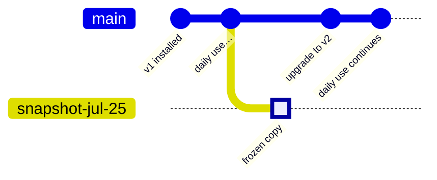

# Snapshots & test copies

You're about to upgrade *Acme HR* to a new version, and the new version changes the database
schema. If the migration mangles a table, "undo" is not a button — the data has moved. What you
want is what you'd do with a spreadsheet before a risky edit: **save a copy first**.

A **snapshot** is that copy, for a whole app: the app's entire database, duplicated at a moment
in time, kept as its own independent thing. The original keeps running; the copy doesn't change
when the original does; you can look at it, run the app against it, or throw it away.

Three everyday problems, one primitive:

| You want | You get |
|---|---|
| "Let me try this on real data without touching the live app" | a **test copy** — fork it, poke at it, delete it |
| "Will this upgrade survive our real data?" | **snapshot-before-update** — a copy taken automatically just before a risky upgrade |
| "Give me real-shaped data on my laptop" | [`substrat scope pull`](/reference/cli#scope-pull) — a governed, masked export to a local SQLite file |

## The picture

Code moves along one line (versions); each app's data moves along another. A snapshot branches
the data line — and, unlike a git branch, it never merges back:

The live app moves on; the copy stays exactly as it was. If v2 turns out bad, the copy — still
runnable, still on v1's schema — is the rollback point.

## Why a copy is enough (no database-branching magic)

Neon and PlanetScale branch databases with copy-on-write storage engines. Substrat doesn't need
one: a [scope](/concepts/tenancy) is **one tenant × one app** — small by construction — so a
full copy takes seconds. And because the copy *is* a scope, it isn't just data: the **same app
code runs against it**. A database branch elsewhere gives you rows; a snapshot here gives you
the running app as it was.

## The one rule everything follows

Module migrations are append-only — never edited, never un-run
([modules](/concepts/modules)). Once data has moved to a new schema, there is no moving it
back. Every snapshot behavior is that rule, cashed out:

- A copy is taken **at the source's current version** — so it runs as-is, no migration needed.
- A copy can move **forward** (bind a newer version; its migrations run on the copy) — which is
  how you rehearse an upgrade on real-shaped data before the live app takes it.
- A copy never moves **backward**, and neither does the live app — "rollback" means *restore
  the pre-upgrade copy*, accepting that writes made since are discarded. Because that price is
  real, the platform pays for the insurance automatically:

::: tip Snapshot-before-update
When an app is updated to a version whose **migrations changed**, the platform takes a snapshot
first — that's the checkbox (on by default) next to "Update to latest" in the Dashboard. A
code-only update takes no snapshot: rebinding the previous version already undoes it.
:::

## Copies expire (on purpose)

A snapshot is real customer data occupying real storage:

- **TTL** — pick 1/7/30 days when creating one; the platform's scheduled sweep deletes expired
  copies — storage wiped, the deletion audited. An auto-deleting copy is also a smaller privacy
  liability than one that lingers.
- **Keep** — a copy without a TTL stays until someone deletes it.
- This delete is the platform's **only hard delete**, and it refuses anything that isn't a
  copy. Live apps only ever archive; an ephemeral copy is the one thing allowed to truly
  disappear.

## Where the data goes (and doesn't)

An app's data lives in its own deployment, not in the control plane
([control plane](/platform/control-plane)). Making or deleting a snapshot is an instruction —
*"copy A into B"*, *"wipe C"* — carried out **inside the app's own deployment**. The platform
keeps only the catalog card: where the copy came from, when, and when it expires. **No app data
crosses to the platform** for any of it.

The one deliberate exception is [`scope pull`](/reference/cli#scope-pull), whose whole point is
moving data out — so it is staff-gated, audited, **pseudonymized by default** (PII columns
and payload fields carry deterministic fake values — the same customer reads the same on
every screen, and nothing in the file is a real name, email or phone; `--full` is an
explicit break-glass), and refused entirely for data pinned to a jurisdiction. It is
pseudonymization, not anonymization: rare combinations, amounts and dates can still
re-identify, so the copy is still handled as personal data.

## What a snapshot is *not*

- **Not backup/PITR.** Durable Object storage already has ~30-day point-in-time recovery —
  a destructive rewind of the live app. A snapshot is the opposite: a non-destructive copy
  that leaves the live app alone. Recovery rewinds; snapshots preview. What backs up *the
  platform's own directory* — the one thing PITR cannot cover, since it is a single Durable
  Object with nothing underneath to rebuild it from — is
  [the control plane's scheduled directory backup](/platform/control-plane#backup-and-recovery).
- **Not a sync.** The copy diverges the moment it's taken, and never merges back.
- **Not a second production.** A copy receives no traffic, runs no integrations or scheduled
  work, and expires. It contains real data, so the same access rules apply — but nothing you
  do in it touches the live app.

## Where you meet it

- **Dashboard → app → Snapshots** — create a test copy with a TTL, watch the expiry countdown,
  delete ([dashboard](/platform/dashboard#snapshots)).
- **Dashboard → app → Deployments** — "Update to latest" with **Snapshot data first**.
- **CLI** — [`substrat scope pull`](/reference/cli#scope-pull) for the local inner loop.
