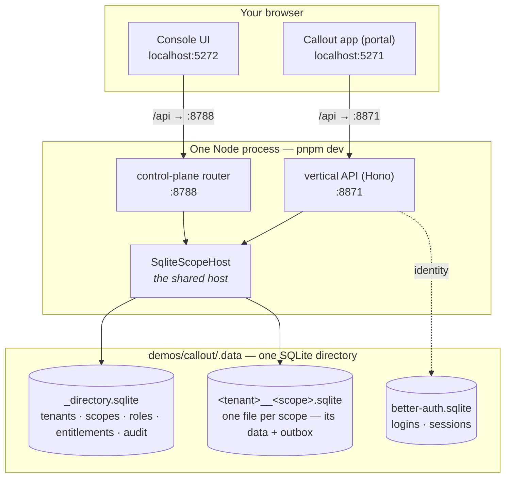
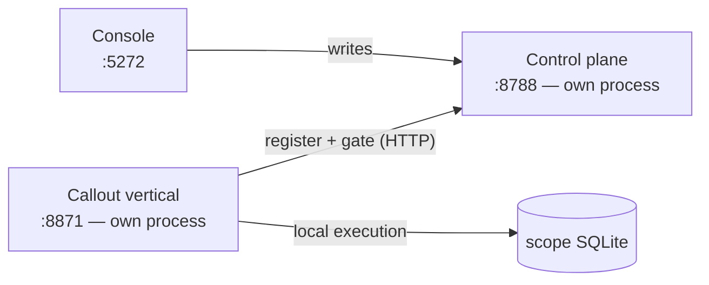

# Running the whole stack locally

[Getting started](/guide/getting-started) builds one host in one script. This page is the
other end: the **entire** flow — a vertical, the shared control plane, and the admin
console — running together on your machine with `pnpm dev` and nothing but local SQLite.
No cloud account, no Docker, no second datastore.

::: tip This is a monorepo command
`pnpm dev` at the root of the [substrat monorepo](https://github.com/substrat-run/substrat)
runs the Callout demo vertical (`demos/callout`) wired to the console (`apps/console`). It is
the reference for what a local stack looks like, not a published tool.
:::

## One command

```sh
pnpm dev
```

It ends on a banner telling you where to go:

```
  substrat · local stack — one process, one SQLite dir
  ────────────────────────────────────────────────────
    ▶ Console (open this)   http://localhost:5272
    ▶ Portal — Callout    http://localhost:5271

      vertical API          http://localhost:8871
      control plane API     http://localhost:8788
  ────────────────────────────────────────────────────
    data   …/demos/callout/.data
```

Open the **console** to act as the platform operator (tenants, scopes, entitlements,
suspend). Open the **portal** to act as a tenant's user (log in as a persona, do work).

## What is actually running

The surprising part — and the thing that makes the flow real rather than mocked — is that
there is **one backend process**. The vertical API and the control plane are two HTTP
listeners over the **same `SqliteScopeHost`**, which owns both the directory and every
scope's data. Two browser apps (Vite dev servers) sit in front, each proxying `/api` to
its own listener.



Because the control plane and the vertical share **one host**, they share **one
directory**. That is why a suspend in the console immediately fails the portal's next
action closed: `getScope` reads the scope's status from `_directory.sqlite` on every call,
and the console just wrote to that same row. There is no sync, no second copy — it is one
`UPDATE` and one `SELECT` against the same file.

### The processes

| Port | Process | What it is |
|---|---|---|
| `5272` | Vite dev server | The **console** — the platform operator's admin UI |
| `5271` | Vite dev server | The **portal** — Callout's tenant-facing app |
| `8871` | Node (Hono) | The **vertical API** — resolves a user, `getScope`, invokes operations |
| `8788` | Node (Hono) | The **control plane** — the audited directory surface the console drives |

The two Node listeners are the *same process* sharing one host; the two Vite servers are
separate. All four are launched and torn down together by `pnpm dev`.

### The databases

Everything lives under `demos/callout/.data` as plain SQLite files (WAL mode — the `-wal` /
`-shm` siblings are SQLite's, not yours to touch):

| File | Owned by | Holds |
|---|---|---|
| `_directory.sqlite` | the shared host | The directory: tenant registry, scope records + lifecycle status, roles, entitlements, tenant-level permission tuples, and the admin audit log |
| `<tenantId>__<scopeId>.sqlite` | the shared host | One per scope — that scope's own tables, permission tuples, and event outbox. Isolated: a scope is its own database and consistency domain |
| `better-auth.sqlite` | the vertical's auth | Identities, credentials, and sessions for the portal's logins |

Debugging is opening a file:

```sh
sqlite3 demos/callout/.data/_directory.sqlite 'SELECT slug, status FROM scopes;'
```

Delete the `.data` directory to reset the world; it re-seeds on the next boot.

## Letting an agent run it

Every demo and every scaffolded project ships a `.claude/launch.json`, so [Claude
Desktop](https://code.claude.com/docs/en/desktop) starts the dev servers itself, opens the
web app in the Browser pane, and — with `autoVerify` on — screenshots and checks for errors
after each edit it makes.

This is worth more here than in most projects. A demo's scenario test composes the host
directly and **never boots `src/server.ts`**, so a green suite says nothing at all about the
HTTP layer. The Browser pane is the reliable way to drive the part the tests skip.

Each process gets its **own** entry rather than the single `concurrently` pair `pnpm dev`
runs, which is the point: Claude can attach the Browser to the web port while reading the
API's log independently. Callout's:

```jsonc
{
  "version": "0.0.1",
  "configurations": [
    { "name": "api", "runtimeExecutable": "pnpm", "runtimeArgs": ["run", "server"],
      "port": 8871, "env": { "ALLOW_DEV_HEADER": "true" }, "autoPort": false },
    { "name": "web", "runtimeExecutable": "pnpm", "runtimeArgs": ["--dir", "app", "dev"],
      "port": 5271, "autoPort": false }
  ]
}
```

### These files are emitted — don't hand-edit them

The topology is declared once in the `substrat.devServers` block of each project's
`package.json`, and the launch file is generated from it by `pnpm lint:launch` (CI runs
`--check` and fails on drift). A declaration names the env var that moves a port and the
file that binds it; the **number is read out of that file**, so moving a port means editing
`src/server.ts` or `app/vite.config.ts` and re-running the emitter — never editing the JSON.

The same block carries `requires` — the keys a process cannot start **without** locally,
checked by `tools/env-preflight.mjs` before the server boots. It is deliberately *not*
emitted into `launch.json`: a launch file starts a server, and what a server needs in order
to start is not something a client-specific adapter should hold. Note this is a different
question from `envSpec`'s `required`, which means required to **deploy** — a hosted install
receives most of its config through per-scope delivery, so keys that are optional there can
still be mandatory on your machine, where no such delivery exists.

### Gotchas

- **Open the session in `demos/<name>`, not the monorepo root.** Preview servers use the
  selected folder as the working directory and do not scan subfolders, so a session opened
  at the root finds no configuration.
- **`autoPort: false` everywhere, deliberately.** The OIDC-only demos redirect to a fixed
  callback and the shop's Better Auth trusts two fixed origins, so a silently reassigned
  port would break the *login*, not the boot — a much worse failure to debug. The cost is
  that a genuine clash is fatal: `demos/rally` and `demos/auth-server` both sit on `:8877`
  and `:5277`, so they cannot run at the same time without `PORT=… WEB_PORT=…`.
- **A process can bind more than the port it declares.** Callout's `api` entry starts the
  vertical API on `:8871` *and* the co-located control plane on `:8788`; only the first is
  declared, because only the first is the one to attach a browser to. If `:8788` is taken —
  by another project, or a stray `pnpm dev:connected` — the entry dies on `EADDRINUSE` for a
  port Claude is not watching, which reads as a server that simply never came up. `CP_PORT=…`
  moves it.
- **No secrets in `launch.json`** — it is committed. Desktop also does not inherit your full
  shell environment, and `env` in `~/.claude/settings.json` reaches *sessions* but not dev
  servers. Put values in **`.dev.vars`** in the project directory instead: it is gitignored,
  `wrangler dev` already reads it, and the `server` script loads it with
  `--env-file-if-exists`, so one file serves every way of starting the vertical. A shell
  variable still wins over it — but only in a terminal, which is exactly the gap that makes
  the file the reliable answer for Desktop.
- **A fresh worktree is a fresh checkout — it has no gitignored files.** Desktop gives every
  session its own [worktree](https://code.claude.com/docs/en/worktrees), and without help a
  new session's first `pnpm dev` fails for reasons that read as code problems: a missing OIDC
  client, an empty `PLATFORM_SECRET`, a demo asking for a model key. The monorepo's root
  `.worktreeinclude` names the gitignored files a worktree needs in order to run, and Claude
  Code copies them from the main checkout when it creates one: `secrets/*.env`, every
  `.env` and `.dev.vars`, and Callout's local `wrangler.jsonc`. What it deliberately does
  **not** copy is `.data/` — each worktree seeds its own SQLite on first boot, so a session
  starts from the seed world rather than inheriting another session's tenants, logins and
  half-run scenarios. `node_modules/` and `dist/` are not copied either: run `pnpm install`
  and `pnpm build` in the new tree. A worktree you create yourself with `git worktree add`
  gets none of this — copy the files by hand or start the session through Desktop.
- **Claude curling its own API from Bash may fail.** The sandboxed Bash tool still blocks
  outbound TCP to `localhost` ([claude-code#28018](https://github.com/anthropics/claude-code/issues/28018)).
  The Browser-pane path is separate and works; wiring up Bash-side `curl` is a deliberate
  `excludedCommands` entry, not something to discover mid-session.

## Two audiences, one directory

The console and the portal are not two views of the same app — they are two **audiences**:

- The **console** is the platform operator. It reaches every tenant, and its actions
  (suspend a tenant, grant an entitlement) are cross-tenant. This is the surface [the
  platform layer](/concepts/platform) describes.
- The **portal** is one tenant's user, confined to their scope by the identity they logged
  in with. Anna sees ElMontage; Mallory sees a different tenant entirely.

From a scope's row in the console you can click **Portal ↗** to jump to that scope's app —
the local stand-in for the production hostname router that maps a domain to
`(tenant, scope, vertical)`.

## Adding tenants and scopes

Everything the console can do, it does against the running directory — so it is the fastest
way to change the local world:

- **New tenant:** the console's Tenants view has a *Create tenant* dialog. It mints a ULID
  and calls the same audited `createTenant` the platform uses.
- **Grant/revoke entitlements, suspend, archive:** all live in the console and take effect
  immediately, because they write the shared directory the portal reads.
- **New scope:** provisioning a scope is on the control-plane API (`POST /scopes`) but does
  not yet have a console button — the demo seeds its scopes in `demos/callout/src/seed.ts`. Add
  one there, or `curl` the API with a platform-actor header.

## Adding another application

A "new application" is a new **vertical**. Today each of the six demo verticals
(`demos/{callout,handlebar,manyfold,meridian,rally,shop}`) ships its own dev server — Callout's
is `demos/callout/src/server.ts` — and each composes its engines + module into a host. (A
seventh directory, `demos/auth-server`, is a shared OIDC provider, not a business vertical.) To
scaffold one, follow [Getting started](/guide/getting-started) with the engines you need, and
[Deploying a vertical](/guide/deploying) when it's ready to ship.

What is **not** wired yet is running several verticals against **one** shared console
locally — that needs each vertical to register into a *separate* control-plane process over
HTTP, rather than co-locating the directory in its own host as the demo does for
convenience. Until that seam exists, the local stack is one vertical + the console; the
console's fleet view is designed for the many-vertical world it will grow into.

## The faithful topology: `pnpm dev:connected`

`pnpm dev` co-locates the control plane and the vertical in one process for speed. To run
the shape production actually uses — a **separate** control plane that the vertical
*registers into* and is *gated by* — use:

```sh
pnpm dev:connected
```

This starts three things: a standalone control plane (its own process, on `:8788`), the
Callout vertical in **connected mode**, and the console pointed at that control plane. On
boot the vertical registers its tenants and scopes into the control plane over HTTP; before
every request it asks the control plane "is this scope still active?" So when you suspend a
scope in the console, the vertical's next action fails closed — the same outcome as the
co-located stack, but now crossing a real process boundary, exactly as it would cross a
deployment boundary in production.



The seam is `ControlPlaneClient` from `@substrat-run/control-plane-api`: `createTenant` /
`provisionScope` / `grantEntitlement` to register, and `assertScopeActive` to gate. One
deliberate limit — the control-plane HTTP surface exposes lifecycle and entitlements but
**not role or grant writes** (those are the permission-diff human checkpoint), so a
connected vertical keeps its permission model local while the shared plane is authoritative
for tenant/scope lifecycle and entitlements.

Unlike the quick `pnpm dev` (which trusts a dev-actor header), the connected control plane
runs **real staff auth** — the console shows a sign-in screen. Sign in with the seeded
operator:

```
markus@substrat.run / substrat123
```

Auth is Better Auth behind a provider-agnostic seam (`sessionPlatformAuth` + a staff
allowlist), so who authenticates staff can change without touching the console or the
router. The vertical registering its scopes is a *service*, not staff — locally it uses the
dev-actor header as a stand-in for a real service credential.

## How production differs

Co-location is a local convenience, not the topology; `pnpm dev:connected` above is the
faithful shape on one machine. In production the control plane is its **own deployment** and
each vertical is a **separate deployment**, all reaching one durable directory — the same
surfaces you see here, split across processes and hosts. The SQLite adapter you run locally
and the Cloudflare adapter you deploy on are the same kernel above
[the scope-host contract](/concepts/scope-host); only the composition root changes.

Getting a vertical from this laptop to that production topology is its own step — the
`substrat` CLI pushes a bundle, and an admission in the console lets a scope serve it. See
[Deploying a vertical](/guide/deploying).

## Next steps

- [Tenants & scopes](/concepts/tenancy) — the tenancy tree the directory records.
- [The platform layer](/concepts/platform) — what the console is a thin client over.
- [Operations & the scope host](/concepts/scope-host) — the seam that makes SQLite-local
  and Cloudflare-deployed the same code.
