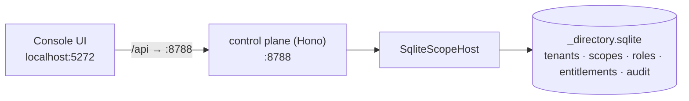

# Running the whole stack locally

[Getting started](/guide/getting-started) builds one host in one script. This page is the
other end: the platform side — the shared control plane and the admin console — running on
your machine with `pnpm dev`, and a demo vertical beside it, all on nothing but local
SQLite. No cloud account, no Docker, no second datastore.

::: tip This is a monorepo command
`pnpm dev` at the root of the [substrat monorepo](https://github.com/substrat-run/substrat)
runs the standalone control-plane dev server (`pnpm --filter @substrat-run/control-plane-api dev`)
with a seeded fleet, and the console (`apps/console`) pointed at it. It is the reference for
what a local platform looks like, not a published tool. A vertical runs separately, from its
own directory.
:::

## One command

```sh
pnpm dev
```

The control plane logs where it is and how to sign in:

```
control-plane API  http://127.0.0.1:8788
directory          /tmp/substrat-cp-…
staff auth         Better Auth — sign in as markus@substrat.run / substrat123
```

Open the **console** on `http://localhost:5272` to act as the platform operator (tenants,
scopes, entitlements, suspend). It runs **real staff auth**, so it opens on a sign-in
screen; use the seeded operator above.

## What is actually running


```mermaid
flowchart LR
  C["Console UI<br/>localhost:5272"] -->|"/api → :8788"| CP["control plane (Hono)<br/>:8788"]
  CP --> H["SqliteScopeHost"]
  H --> D[("_directory.sqlite<br/>tenants · scopes · roles · entitlements · audit")]
```

### The processes

| Port | Process | What it is |
|---|---|---|
| `5272` | Vite dev server | The **console** — the platform operator's admin UI |
| `8788` | Node (Hono) | The **control plane** — the audited directory surface the console drives |

Both are launched and torn down together by `pnpm dev`. The control plane seeds a small
fleet on boot — several tenants, a suspended one whose scopes fail closed by cascade, and a
scope in every status the console renders — so the console has something with real shape to
show. `CP_SKIP_SEED=1` starts it empty instead.

Auth is Better Auth behind a provider-agnostic seam (`sessionPlatformAuth` + a staff
allowlist), so who authenticates staff can change without touching the console or the
router. `CP_UNSAFE_AUTH=1` on the control plane, with `VITE_DEV_ACTOR` set for the console,
swaps it for the UNSAFE dev-actor header stub — which is only ever acceptable bound to
`127.0.0.1`, as this server is.

### The databases

The control plane keeps its directory in `SUBSTRAT_DIR`, or a fresh temporary directory when
that is unset — so by default every boot starts from the seed. A demo vertical keeps its own
under `demos/<name>/.data`. Both are plain SQLite files (WAL mode — the `-wal` / `-shm`
siblings are SQLite's, not yours to touch):

| File | Holds |
|---|---|
| `_directory.sqlite` | The directory: tenant registry, scope records + lifecycle status, roles, entitlements, tenant-level permission tuples, and the admin audit log |
| `<tenantId>__<scopeId>.sqlite` | One per scope — that scope's own tables, permission tuples, and event outbox. Isolated: a scope is its own database and consistency domain |

There is no credentials database in a vertical. Every demo is OIDC-only: accounts live at the
issuer, and the directory holds only the *link* from each issuer subject to a principal — the
seed writes it from `src/personas.ts`, the same array the dev issuer's picker lists. Locally
that issuer is [`@substrat-run/dev-issuer`](/reference/dev-issuer) on `:8879`, started by the
demo's own `dev` script.

Debugging is opening a file:

```sh
sqlite3 demos/todo/.data/_directory.sqlite 'SELECT slug, status FROM scopes;'
```

**Use a `sqlite3` of 3.42 or later on a scope file a subject erasure has run on.** An
erasure removes the erased words from a search index's stored data with FTS5's
`secure-delete`, and FTS5 then records that index in a format older SQLite cannot read. The
rest of the file still opens on an older `sqlite3`, but a query that touches that index fails.
Debian 12 ships 3.40.1, for example. Run `sqlite3 --version` to check, and get a newer one from
your package manager's backports, Homebrew (`brew install sqlite`), or the prebuilt binaries at
[sqlite.org/download](https://sqlite.org/download.html). Node 22's `node:sqlite` (3.51) reads it
as well. Exports and backups are not affected: they never carry a search index, and the index
is rebuilt when one is loaded.

Delete a demo's `.data` directory to reset its world; it re-seeds on the next boot.

## Letting an agent run it

Every demo and every scaffolded project ships a `.claude/launch.json`, so [Claude
Desktop](https://code.claude.com/docs/en/desktop) starts the dev servers itself, opens the
web app in the Browser pane, and — with `autoVerify` on — screenshots and checks for errors
after each edit it makes.

This is worth more here than in most projects. A demo's scenario test composes the host
directly and **never boots `src/server.ts`**, so a green suite says nothing at all about the
HTTP layer. The Browser pane is the reliable way to drive the part the tests skip.

Each process gets its **own** entry rather than the single `concurrently` line a demo's
`dev` script runs, which is the point: Claude can attach the Browser to the web port while
reading the API's log independently. Todo's, less its test-UI entry:

```jsonc
{
  "version": "0.0.1",
  "configurations": [
    { "name": "issuer", "runtimeExecutable": "pnpm", "runtimeArgs": ["run", "issuer"],
      "port": 8879, "autoPort": false },
    { "name": "api", "runtimeExecutable": "pnpm", "runtimeArgs": ["run", "server"],
      "port": 8878, "autoPort": false },
    { "name": "web", "runtimeExecutable": "pnpm", "runtimeArgs": ["--dir", "app", "dev"],
      "port": 5278, "autoPort": false }
  ]
}
```

Three entries, and no `env` block — there is no dev header to switch on. The first entry
is the **local login**: [`@substrat-run/dev-issuer`](/reference/dev-issuer), a real OpenID
Connect provider whose only shortcut is that `/authorize` lists the vertical's personas
(`src/personas.ts`) instead of asking for a password. Picking a name there *is* the
production round-trip — the API is an ordinary relying party against whatever
`OIDC_ISSUER` names, so the login you exercise in dev is the one a deployment runs, and
moving to a real issuer changes configuration, not code. A script that needs to act as
someone mints a token at the issuer, never in the vertical — a JSON body naming the
subject, and the returned `access_token` is the bearer:

```sh
curl -XPOST localhost:8879/dev/token -d '{"sub":"dev|ada"}'   # → { access_token, id_token, … }
```

### These files are emitted — don't hand-edit them

The topology is declared once in the `substrat.devServers` block of each project's
`package.json`, and the launch file is generated from it by `pnpm lint:launch` (CI runs
`--check` and fails on drift). A declaration names the env var that moves a port and the
file that binds it; the **number is read out of that file**, so moving a port means editing
`src/server.ts` or `app/vite.config.ts` and re-running the emitter — never editing the JSON.

The same block carries `requires` — the keys a process cannot start **without** locally,
checked by `tools/env-preflight.mjs` before the server boots. It is deliberately *not*
emitted into `launch.json`: a launch file starts a server, and what a server needs in order
to start is not something a client-specific adapter should hold. Note this is a different
question from `envSpec`'s `required`, which means required to **deploy** — a hosted install
receives most of its config through per-scope delivery, so keys that are optional there can
still be mandatory on your machine, where no such delivery exists.

### Gotchas

- **Open the session in `demos/<name>`, not the monorepo root.** Preview servers use the
  selected folder as the working directory and do not scan subfolders, so a session opened
  at the root finds no configuration.
- **`autoPort: false` everywhere, deliberately.** Every demo vertical is OIDC-only and
  redirects to a fixed callback, so a silently reassigned port would break the *login*, not
  the boot — a much worse failure to debug. The cost is
  that a genuine clash is fatal: two demos declaring the same port cannot run at the same
  time without `PORT=… WEB_PORT=… ISSUER_PORT=…` — all three, because every demo's dev
  issuer sits on `:8879` by default, so moving only the API and the web port still leaves
  the second issuer dying on `EADDRINUSE`.
- **An entry declares a port, not a URL.** The Browser pane opens that server's bare
  origin, and nothing in the file can deep-link a path or a query under it — so a page
  that is not the app's root is somewhere Claude navigates *after* the preview comes up.
  The one worth navigating to by default is **`/api/docs`**, which
  [`demos/meridian`](https://github.com/substrat-run/substrat/blob/main/demos/meridian/src/docs.ts)
  and `demos/manyfold` serve: Scalar's API reference over that vertical's own
  `/openapi.json`, from that vertical's own origin. No CDN — the renderer is a pinned
  bundle served as a local asset — and no proxy, so a try-it request is same-origin, the
  browser attaches the session cookie you logged in with, and every call executes as the
  principal you actually are. A 403 there is the permission system working.
- **No secrets in `launch.json`** — it is committed. Desktop also does not inherit your full
  shell environment, and `env` in `~/.claude/settings.json` reaches *sessions* but not dev
  servers. Put values in **`.dev.vars`** in the project directory instead: it is gitignored,
  `wrangler dev` already reads it, and the `server` script loads it with
  `--env-file-if-exists`, so one file serves every way of starting the vertical. A shell
  variable still wins over it — but only in a terminal, which is exactly the gap that makes
  the file the reliable answer for Desktop.
- **A fresh worktree is a fresh checkout — it has no gitignored files.** Desktop gives every
  session its own [worktree](https://code.claude.com/docs/en/worktrees), and without help a
  new session's first `pnpm dev` fails for reasons that read as code problems: a missing OIDC
  client, an empty `PLATFORM_SECRET`, a demo asking for a model key. The monorepo's root
  `.worktreeinclude` names the gitignored files a worktree needs in order to run, and Claude
  Code copies them from the main checkout when it creates one: `secrets/*.env`, every
  `.env` and `.dev.vars`. What it deliberately does
  **not** copy is `.data/` — each worktree seeds its own SQLite on first boot, so a session
  starts from the seed world rather than inheriting another session's tenants, logins and
  half-run scenarios. `node_modules/` and `dist/` are not copied either: run `pnpm install`
  and `pnpm build` in the new tree. A worktree you create yourself with `git worktree add`
  gets none of this — copy the files by hand or start the session through Desktop.
- **Claude curling its own API from Bash may fail.** The sandboxed Bash tool still blocks
  outbound TCP to `localhost` ([claude-code#28018](https://github.com/anthropics/claude-code/issues/28018)).
  The Browser-pane path is separate and works; wiring up Bash-side `curl` is a deliberate
  `excludedCommands` entry, not something to discover mid-session.

## Two audiences

The console and a vertical's app are not two views of the same app — they are two
**audiences**:

- The **console** is the platform operator. It reaches every tenant, and its actions
  (suspend a tenant, grant an entitlement) are cross-tenant. This is the surface [the
  platform layer](/concepts/platform) describes.
- A **vertical's app** is one tenant's user, confined to their scope by the identity they
  logged in with. In `demos/todo`, Ada and Björn share a tenant; Cleo sees a different one
  entirely.

Locally the two do not share a directory: `pnpm dev`'s control plane holds its seeded fleet,
and each demo seeds its own tenants into its own host. Setting `VITE_PORTAL_BASE` on the
console to a vertical's dev URL turns a scope's **Portal ↗** link on — the local stand-in for
the production hostname router that maps a domain to `(tenant, scope, vertical)`.

## Adding tenants and scopes

Everything the console can do, it does against the running directory — so it is the fastest
way to change the local world:

- **New tenant:** the console's Tenants view has a *Create tenant* dialog. It mints a ULID
  and calls the same audited `createTenant` the platform uses.
- **Grant/revoke entitlements, suspend, archive:** all live in the console and take effect
  immediately.
- **New scope:** provisioning a scope is on the control-plane API (`POST /scopes`) but does
  not yet have a console button — the dev server seeds its fleet in
  `packages/control-plane-api/dev/server.mts`. Add one there, or `curl` the API with a
  platform-actor header.

## Adding another application

A "new application" is a new **vertical**. Today each of the seven demo verticals
(`demos/{handlebar,manyfold,meridian,shop,ticket0,tock,todo}`) ships its own dev server —
Todo's is `demos/todo/src/server.ts` — and each composes its engines + module into a host.
(An eighth directory, `demos/auth-server`, is a shared OIDC provider, not a business vertical.)
Run one with `pnpm --filter @substrat-run/demo-<name> dev`. To scaffold one, follow
[Getting started](/guide/getting-started) with the engines you need, and
[Deploying a vertical](/guide/deploying) when it's ready to ship.

What is **not** wired locally is a demo vertical registering into the control plane `pnpm dev`
runs: each demo keeps its directory in its own host, for convenience, so the console's fleet
view is the seeded one rather than the demos you have running.

## How production differs

A demo holding its own directory is a local convenience, not the topology. In production the
control plane is its **own deployment** and
each vertical is a **separate deployment**, all reaching one durable directory — the same
surfaces you see here, split across processes and hosts. The SQLite adapter you run locally
and the Cloudflare adapter you deploy on are the same kernel above
[the scope-host contract](/concepts/scope-host); only the composition root changes.

Getting a vertical from this laptop to that production topology is its own step — the
`substrat` CLI pushes a bundle, and an admission in the console lets a scope serve it. See
[Deploying a vertical](/guide/deploying).

## Next steps

- [Tenants & scopes](/concepts/tenancy) — the tenancy tree the directory records.
- [The platform layer](/concepts/platform) — what the console is a thin client over.
- [Operations & the scope host](/concepts/scope-host) — the seam that makes SQLite-local
  and Cloudflare-deployed the same code.
